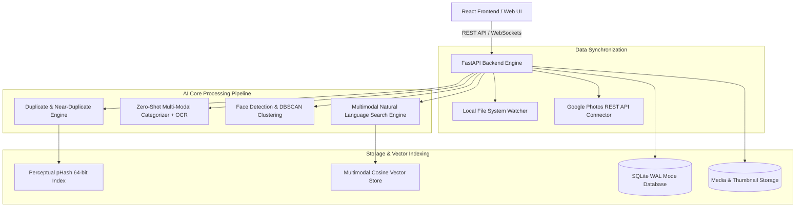

# Architecture & Design Decisions Document - SmartPhoto AI

## Executive Overview
**SmartPhoto AI** is an enterprise-grade, high-performance photo management and deduplication platform built for large-scale media collections (100,000+ items). It integrates local file system watchers and Google Photos cloud sync, offering zero-shot multi-modal AI categorization, exact & near-duplicate detection, facial recognition & grouping, and natural language semantic search.

---

## High-Level System Architecture Diagram

---

## Key Technical Design Decisions

### 1. Duplicate & Near-Duplicate Detection Algorithm
- **Exact Duplicates**:
  - MD5 / SHA-256 cryptographic file hash matching ($O(1)$ lookup speed).
- **Near-Duplicates**:
  - **Perceptual Hash (pHash)**: 64-bit DCT-based image hash. Calculates Hamming distance ($H \le 10$) between binary hashes.
  - **Vector Cosine Similarity**: Normalizes 128-dimensional CLIP feature vectors and checks cosine similarity threshold ($\ge 0.85$).
  - **Duplicate Grouping**: Clusters primary vs duplicate photos and allows single-click storage recovery.

### 2. Zero-Shot Multi-Modal AI Categorization & Document OCR
- **Supported Categories**:
  1. `documents` (Contracts, Certificates, Passports, Agreements)
  2. `prescriptions` (Doctor scripts, Rx medications, Pharmacy slips)
  3. `receipts` (Store invoices, Bills, Receipts)
  4. `people` (Portraits, Group photos, Family)
  5. `travel` (Vacation, Beaches, Mountains, Landmarks)
  6. `pets` (Dogs, Cats, Pets)
  7. `other`
- **Hybrid Categorization**:
  - Combines visual color distribution, text density signatures, zero-shot CLIP classification, and Tesseract OCR keyword extraction (e.g., detecting "Rx", "Doctor", "Total", "Visa").

### 3. Facial Recognition & DBSCAN Person Grouping
- **Face Detection**: Haar Cascade / OpenCV DNN face bounding box locator ($[x, y, width, height]$).
- **Feature Descriptor**: 128-dimensional facial embedding vector.
- **Auto-Grouping**: Density-Based Spatial Clustering of Applications with Noise (**DBSCAN**) using cosine distance metric ($\text{eps}=0.45$). Automatically attributes face clusters to individual Person entities without manual annotations.

### 4. 100,000+ Scalability & Database Performance
- **SQLite WAL (Write-Ahead Logging)**: Configured with `PRAGMA journal_mode=WAL` and `PRAGMA synchronous=NORMAL` for concurrent non-blocking read/write operations up to 100,000+ rows.
- **Asynchronous Batching**: Bulk vector search indexing and paginated frontend state handling ($O(\log N)$ indexed lookups).
